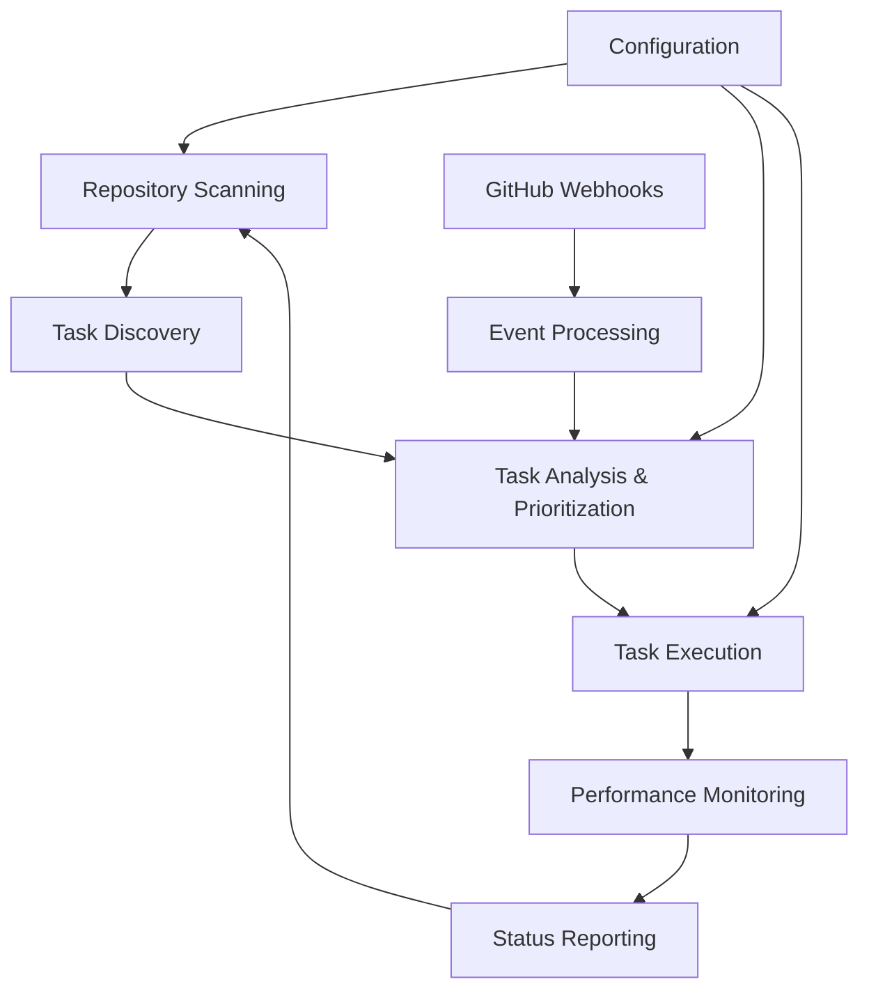

# Architecture Documentation

## System Overview

The Claude Code Manager Service is an autonomous software development lifecycle (SDLC) management system that automates task discovery, prioritization, and execution across GitHub repositories using AI agents.

## Core Components

### 1. Task Discovery & Analysis
- **Autonomous Backlog Manager**: Scans repositories for potential work items
- **Task Analyzer**: Identifies TODOs, stale issues, and refactoring opportunities
- **Performance Monitor**: Tracks system performance and resource usage

### 2. Execution Engine
- **Orchestrator**: Coordinates task execution across different AI platforms
- **Continuous Executor**: Manages long-running autonomous execution cycles
- **GitHub API Integration**: Handles repository interactions and webhook processing

### 3. Data Management
- **Database Task Tracker**: Persistent storage for task state and history
- **Configuration Service**: Centralized configuration management
- **Security Module**: Authentication, authorization, and vulnerability scanning

## Data Flow

## Component Architecture

### Async Operations Layer
- `async_orchestrator.py`: Asynchronous task coordination
- `async_file_operations.py`: Non-blocking file I/O
- `async_github_api.py`: Asynchronous GitHub API client
- `async_task_analyzer.py`: Concurrent task analysis

### Service Layer
- `services/repository_service.py`: Repository management
- `services/task_service.py`: Task lifecycle management
- `services/issue_service.py`: GitHub issue handling
- `services/database_service.py`: Data persistence
- `services/configuration_service.py`: Configuration management

### Core Engine
- `orchestrator.py`: Main execution coordinator
- `continuous_backlog_executor.py`: Autonomous execution engine
- `task_prioritization.py`: Intelligent task ranking
- `performance_monitor.py`: System health monitoring

## Security Architecture

### Authentication & Authorization
- GitHub Personal Access Token (PAT) management
- Secure credential storage in environment variables
- Token rotation and expiration handling

### Vulnerability Management
- Automated security scanning of repositories
- Dependency vulnerability assessment
- Code quality and security metrics tracking

### Data Protection
- Sensitive data encryption
- Secure configuration management
- Audit logging for compliance

## Scalability Considerations

### Horizontal Scaling
- Stateless service design for container orchestration
- Message queue integration for distributed processing
- Load balancing for high-availability deployments

### Performance Optimization
- Asynchronous processing for I/O-bound operations
- Caching layer for GitHub API responses
- Database connection pooling
- Rate limiting to respect API quotas

## Technology Stack

### Core Technologies
- **Language**: Python 3.10+
- **Framework**: AsyncIO for concurrent operations
- **Database**: SQLite with migration support
- **API Client**: PyGithub for GitHub integration
- **Web Interface**: Flask for dashboard

### Development Tools
- **Testing**: pytest with async support
- **Code Quality**: mypy for type checking
- **Performance**: Built-in performance monitoring
- **Documentation**: Markdown with status reporting

## Deployment Architecture

### Container Strategy
- Multi-stage Docker builds for optimized images
- Development container with full toolchain
- Production container with minimal footprint
- Security scanning integrated into build pipeline

### CI/CD Pipeline
- Automated testing on pull requests
- Security scanning and vulnerability assessment
- Performance regression testing
- Automated deployment with rollback capabilities

## Monitoring & Observability

### Health Checks
- Service health endpoints
- Database connectivity checks
- GitHub API availability monitoring
- Task execution success rates

### Metrics Collection
- Performance metrics tracking
- Resource utilization monitoring
- DORA metrics for development velocity
- Custom business metrics

### Alerting
- Failed task execution notifications
- Performance threshold violations
- Security vulnerability alerts
- System health degradation warnings

## Integration Points

### External Services
- **GitHub API**: Repository management and webhook processing
- **Terragon Labs**: AI agent execution platform
- **Claude Flow**: Swarm intelligence coordination
- **Monitoring Services**: Prometheus, Grafana integration points

### Internal Interfaces
- REST API for external integrations
- WebSocket for real-time updates
- Command-line interface for manual operations
- Web dashboard for monitoring and control

## Future Enhancements

### Planned Features
- Multi-repository project coordination
- Advanced ML-based task prioritization
- Integration with additional AI platforms
- Enterprise authentication (SSO/SAML)
- Advanced analytics and reporting

### Extensibility
- Plugin system for custom analyzers
- Webhook system for external integrations
- Custom prompt template system
- Configurable execution strategies