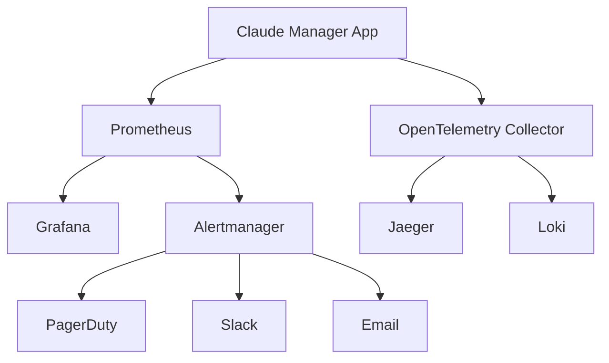

# Monitoring and Observability Runbook

## Overview

This runbook provides operational procedures for monitoring and observability in the Claude Code Manager system.

## Architecture

### Monitoring Stack



### Key Components

- **Prometheus**: Metrics collection and alerting
- **Grafana**: Visualization and dashboards
- **Alertmanager**: Alert routing and notification
- **OpenTelemetry**: Distributed tracing and logs
- **Jaeger**: Trace visualization
- **Loki**: Log aggregation

## Health Checks

### Application Health

```bash
# Check application health
curl http://localhost:5000/health

# Expected response:
{
  "status": "healthy",
  "timestamp": "2025-08-02T10:00:00Z",
  "version": "0.1.0",
  "checks": {
    "database": "healthy",
    "redis": "healthy",
    "github_api": "healthy"
  }
}
```

### Monitoring Infrastructure Health

```bash
# Check Prometheus
curl http://localhost:9090/-/healthy

# Check Grafana
curl http://localhost:3000/api/health

# Check Alertmanager
curl http://localhost:9093/-/healthy

# Check OpenTelemetry Collector
curl http://localhost:13133/
```

## Common Alert Scenarios

### Application Down

**Alert**: `ApplicationDown`
**Severity**: Critical

#### Immediate Actions

1. **Verify the alert**:
   ```bash
   curl -I http://localhost:5000/health
   docker-compose ps claude-manager
   ```

2. **Check container status**:
   ```bash
   docker logs claude-manager-app --tail 50
   docker inspect claude-manager-app
   ```

3. **Restart if necessary**:
   ```bash
   docker-compose restart claude-manager
   ```

4. **Check dependencies**:
   ```bash
   docker-compose ps redis postgres
   ```

#### Root Cause Analysis

1. **Check application logs**:
   ```bash
   docker logs claude-manager-app --since 30m
   ```

2. **Check system resources**:
   ```bash
   docker stats claude-manager-app
   ```

3. **Verify configuration**:
   ```bash
   docker exec claude-manager-app env | grep -E "(DATABASE|REDIS|GITHUB)"
   ```

### High Error Rate

**Alert**: `HighErrorRate`
**Severity**: Warning

#### Investigation Steps

1. **Check error patterns**:
   ```bash
   # View recent error logs
   docker logs claude-manager-app --since 10m | grep -i error
   
   # Check Grafana dashboard for error trends
   open http://localhost:3000/d/app-overview
   ```

2. **Identify error sources**:
   ```bash
   # Check API endpoint errors
   curl http://localhost:5000/api/metrics | grep http_requests_total
   
   # Check database connection errors
   docker logs claude-manager-postgres --since 10m
   ```

3. **Check upstream dependencies**:
   ```bash
   # GitHub API status
   curl -I https://api.github.com
   
   # Internal service health
   curl http://localhost:5000/health
   ```

### High Response Time

**Alert**: `HighResponseTime`
**Severity**: Warning

#### Performance Investigation

1. **Check current performance**:
   ```bash
   # View response time metrics
   curl http://localhost:5000/api/metrics | grep http_request_duration
   ```

2. **Identify slow endpoints**:
   - Check Grafana dashboard: Response Time by Endpoint
   - Review traces in Jaeger: http://localhost:16686

3. **Check system resources**:
   ```bash
   # CPU and memory usage
   docker stats claude-manager-app
   
   # Database performance
   docker exec claude-manager-postgres psql -U claude_user -c "SELECT * FROM pg_stat_activity;"
   ```

### Database Issues

**Alert**: `DatabaseConnectionFailure`
**Severity**: Critical

#### Database Troubleshooting

1. **Check database status**:
   ```bash
   docker-compose ps postgres redis
   docker logs claude-manager-postgres --tail 20
   ```

2. **Test connectivity**:
   ```bash
   # PostgreSQL
   docker exec claude-manager-postgres pg_isready
   
   # Redis
   docker exec claude-manager-redis redis-cli ping
   ```

3. **Check connections**:
   ```bash
   # PostgreSQL connections
   docker exec claude-manager-postgres psql -U claude_user -c "SELECT count(*) FROM pg_stat_activity;"
   
   # Redis connections
   docker exec claude-manager-redis redis-cli info clients
   ```

### GitHub API Rate Limiting

**Alert**: `GitHubAPIRateLimitLow`
**Severity**: Warning

#### Rate Limit Management

1. **Check current rate limit**:
   ```bash
   curl -H "Authorization: token $GITHUB_TOKEN" \
        https://api.github.com/rate_limit
   ```

2. **Review API usage patterns**:
   - Check application logs for API calls
   - Review Grafana dashboard: GitHub API Usage

3. **Implement rate limiting mitigation**:
   - Enable request caching
   - Reduce polling frequency
   - Use conditional requests

## Monitoring Best Practices

### Metric Collection

1. **Application Metrics**:
   - Response time and throughput
   - Error rates by endpoint
   - Business metrics (tasks completed, etc.)

2. **Infrastructure Metrics**:
   - CPU, memory, disk usage
   - Network I/O
   - Container health

3. **External Dependencies**:
   - GitHub API rate limits
   - Database connection health
   - Third-party service availability

### Dashboard Maintenance

1. **Regular Review**:
   - Weekly dashboard review meetings
   - Update thresholds based on trends
   - Add new metrics as needed

2. **Alert Tuning**:
   - Reduce false positives
   - Ensure appropriate severity levels
   - Test alert routing regularly

### Log Management

1. **Log Levels**:
   - ERROR: System errors requiring attention
   - WARN: Potential issues or degraded performance
   - INFO: Normal operations and key events
   - DEBUG: Detailed troubleshooting information

2. **Log Rotation**:
   - Configure appropriate retention periods
   - Monitor disk usage
   - Archive important logs

## Escalation Procedures

### Severity Levels

1. **Critical (P1)**:
   - Complete service outage
   - Data loss or corruption
   - Security breach
   - **Response Time**: 15 minutes
   - **Escalation**: Immediate PagerDuty + Slack

2. **High (P2)**:
   - Major feature unavailable
   - Significant performance degradation
   - **Response Time**: 1 hour
   - **Escalation**: Slack + Email

3. **Medium (P3)**:
   - Minor feature issues
   - Warning thresholds exceeded
   - **Response Time**: 4 hours
   - **Escalation**: Email

4. **Low (P4)**:
   - Informational alerts
   - Capacity planning warnings
   - **Response Time**: Next business day
   - **Escalation**: Email

### Contact Information

- **Primary On-Call**: PagerDuty rotation
- **Engineering Manager**: Slack @eng-manager
- **Infrastructure Team**: #infrastructure channel
- **Database Team**: #database channel

## Maintenance Procedures

### Planned Maintenance

1. **Pre-Maintenance**:
   - Create maintenance silence in Alertmanager
   - Notify stakeholders via Slack
   - Backup critical data

2. **During Maintenance**:
   - Monitor health checks
   - Test functionality after changes
   - Update documentation as needed

3. **Post-Maintenance**:
   - Remove maintenance silences
   - Verify all services are healthy
   - Send completion notification

### Emergency Maintenance

1. **Immediate Response**:
   - Assess impact and severity
   - Notify stakeholders immediately
   - Implement temporary fixes if possible

2. **Resolution**:
   - Apply permanent fix
   - Conduct post-incident review
   - Update runbooks and procedures

## Troubleshooting Tools

### Command Line Tools

```bash
# Quick health check script
#!/bin/bash
echo "Checking application health..."
curl -s http://localhost:5000/health | jq

echo "Checking container status..."
docker-compose ps

echo "Checking logs for errors..."
docker logs claude-manager-app --since 5m | grep -i error | tail -10
```

### Web Interfaces

- **Grafana**: http://localhost:3000 (admin/admin)
- **Prometheus**: http://localhost:9090
- **Alertmanager**: http://localhost:9093
- **Jaeger**: http://localhost:16686

### Log Analysis

```bash
# Find error patterns
docker logs claude-manager-app 2>&1 | grep -E "(ERROR|CRITICAL|FATAL)" | tail -20

# Check for memory issues
docker logs claude-manager-app 2>&1 | grep -i "memory\|oom" | tail -10

# Monitor real-time logs
docker logs -f claude-manager-app
```

## Recovery Procedures

### Application Recovery

1. **Graceful Restart**:
   ```bash
   docker-compose restart claude-manager
   ```

2. **Full Stack Restart**:
   ```bash
   docker-compose down
   docker-compose up -d
   ```

3. **Database Recovery**:
   ```bash
   # Restore from backup
   docker-compose exec postgres pg_restore -U claude_user -d claude_manager /backup/latest.sql
   ```

### Data Recovery

1. **Database Backup**:
   ```bash
   docker-compose exec postgres pg_dump -U claude_user claude_manager > backup.sql
   ```

2. **Volume Backup**:
   ```bash
   docker run --rm -v claude-manager_postgres_data:/data -v $(pwd):/backup alpine tar czf /backup/postgres_data.tar.gz /data
   ```

## Performance Optimization

### Monitoring Performance

1. **Key Metrics to Watch**:
   - Response time percentiles (P50, P95, P99)
   - Throughput (requests per second)
   - Error rate
   - Resource utilization

2. **Performance Baselines**:
   - Response time: < 200ms for P95
   - Error rate: < 1%
   - CPU usage: < 70% average
   - Memory usage: < 80%

### Optimization Strategies

1. **Application Level**:
   - Database query optimization
   - Caching implementation
   - Connection pooling

2. **Infrastructure Level**:
   - Resource scaling
   - Load balancing
   - Database tuning

## Security Monitoring

### Security Alerts

1. **Failed Authentication Attempts**:
   - Monitor login failures
   - Alert on brute force patterns

2. **Unusual API Usage**:
   - High request rates
   - Requests from unusual IPs
   - Access to sensitive endpoints

3. **System Security**:
   - Container vulnerabilities
   - Dependency security issues
   - Configuration drift

### Security Response

1. **Immediate Actions**:
   - Block suspicious IPs
   - Disable compromised accounts
   - Isolate affected systems

2. **Investigation**:
   - Review access logs
   - Check for data exfiltration
   - Analyze attack patterns

3. **Recovery**:
   - Patch vulnerabilities
   - Update security policies
   - Conduct security review

## Contact and Support

### Internal Teams

- **Engineering**: #engineering
- **Infrastructure**: #infrastructure
- **Security**: #security
- **Product**: #product

### External Support

- **GitHub Support**: https://support.github.com
- **Cloud Provider**: [Provider support portal]
- **Monitoring Vendor**: [Vendor support]

### Documentation

- **Internal Wiki**: [Internal documentation URL]
- **GitHub Repository**: [Repository URL]
- **Monitoring Dashboards**: http://localhost:3000

---

**Last Updated**: 2025-08-02  
**Next Review**: 2025-09-02  
**Owner**: Infrastructure Team